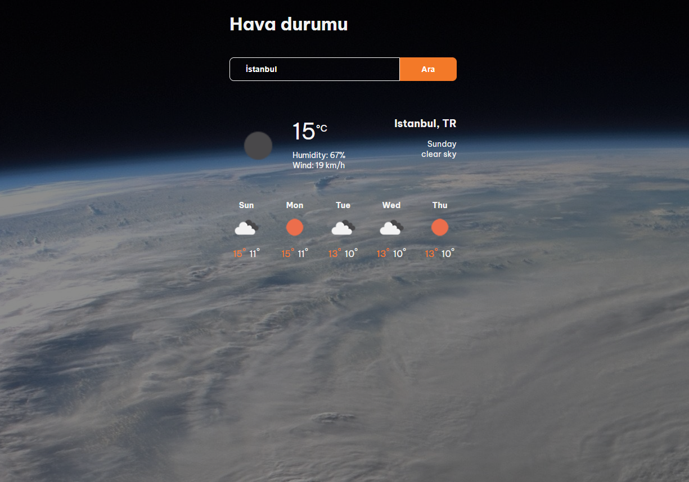

<h1> React Hava durumu uygulaması </h2>

 Openweathermap ve opencagedata API'lerini kullanarak konumların hava durumunu görebilirsiniz

 Örnek site: 

<a href="https://boragungoren.netlify.app">
https://boragungoren.netlify.app
</a>

<h2> Ekran görüntüsü </h2>

